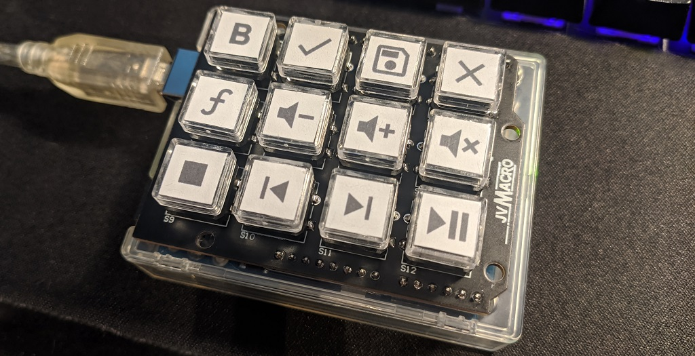

# **JvMacro: Arduino Macro Keypad Shield** #
The poor man's macro keypad is here. For 20 bucks or less, you can get into the world of media keys and shortcuts. It won't have fancy Cherry switches, but the cheap clear B3F button caps look way more professional than glued labels anyway.

Features
=======
* 12 tactile  B3F buttons with easy addable labels. Printable template included.
* Standard Arduino UNO shield so you can finally give that old board a permanent use.
* Uses Atmega16U2 Arduino UNO as USB HID controller thanks to HoodLoader2.
* Included code with n-key rollover, 3 keypresses and one media function assignable per button.
* Fully open source hardware and software. Just show me your results if you like it :)

Bill of Materials
=============
|Part|Needed|Pieces|Price($)|Supplier|
|-|-|-|-|-|
|JvMacro PCB|**1**|5|8|JLCPCB|
|B3F tactile buttons with caps|**12**|25|5|Aliexpress|
|Male headers 0.1" pitch|**32**|400|1|Aliexpress|
|Arduino UNO 16U2 with case|**1**|1|7|Aliexpress|
|**Total**|||**21**||

The following cost are current shipped prices. As you see, it gets rapidly cheaper as you make more than one.

PCB Assembly
===========
1. Push all 12 B3F buttons into PCB.
2. Cut off B3F legs that stick out of PCB.
3. Solder all 12 B3F buttons.
4. Cut pin headers to size (1x6, 2x8, 1x10-pin).
5. Solder headers. (I like to use my Arduino as a holder).
6. Print and cut button labels with the available template.
7. Put labels into keycaps and push them onto B3F buttons.

Firmware Flashing
==============
1. Install [Arduino IDE](https://www.arduino.cc).
2. Install [NicoHood's HoodLoader2](https://github.com/NicoHood/HoodLoader2).
3. Install [NicoHood's Arduino HID Project](https://github.com/NicoHood/HID).
4. Flash HoodLoader2 to Arduino UNO.
5. Flash jvmacro_io.ino as "HoodLoader2 Uno".
6. Edit jvmacro_usb.ino to fit your printed keycaps.
7. Flash jvmacro_usb.ino as "HoodLoader2 16u2".
8. Enjoy!

